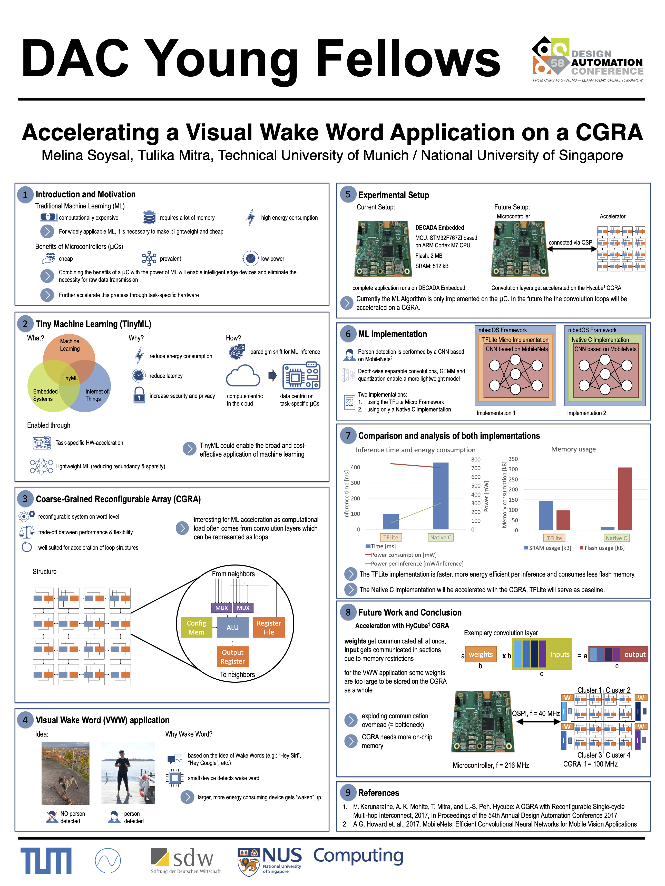

# Research-Internship-NUS

## Visual Wake Word Implementation
[The VWW folder](VWW-Application) contains all relevant scripts (incl. documentation) I used for the implementation of a Visual Wake Word Application for Person Detection on a microcontroller. There are two different implementation: One is based on the TFLite Framework and the other one is completely implemented in Vanilla C Code without using any additional libraries.

## SPI-Connection Manuca FPGA
[The SPI Connection folder](SPI-Connection-Manuca-FPGA) contains all relevant scripts and documentation I used and generated for the SPI connection between the FPGA simulating the Hycube CGRA Chip and the [Manuca](https://www.developer.tech.gov.sg/products/categories/sensor-platforms-and-internet-of-things/decada-embedded/overview.html) Air Microcontroller.

This work is part of my internship within the [PACE project](https://blog.nus.edu.sg/paceaccelerator/) supervised by Prof. Tulika Mitra from National University of Singapore

I presented a Poster at the DAC Young Fellow Forum 2022 in San Francisco, CA, USA:

